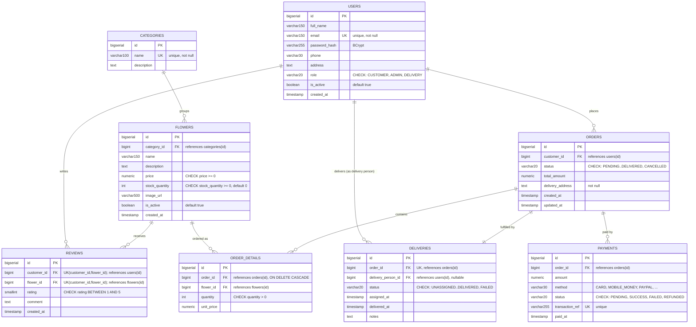

# Online Flower Shop — Entity-Relationship Diagram

This diagram visualizes the PostgreSQL schema defined in
`docs/ARCHITECTURE.md` section 3 exactly as implemented — same 8 entities,
same primary/foreign keys, same cardinalities. It does not introduce or
redesign any data model decisions; it is a visual reference for the schema
already in place.

## 1. Entity-Relationship Diagram

### Notes on cardinality (matching the SQL exactly)

- **CATEGORIES → FLOWERS**: one category has many flowers; every flower
  belongs to exactly one category (`flowers.category_id NOT NULL`).
- **USERS → ORDERS**: one customer (a `users` row with role `CUSTOMER`)
  places many orders (`orders.customer_id NOT NULL`).
- **ORDERS → ORDER_DETAILS**: one order has many line items; each line item
  belongs to exactly one order, and is deleted automatically if the order is
  deleted (`ON DELETE CASCADE`).
- **FLOWERS → ORDER_DETAILS**: one flower can appear in many order line
  items across many orders.
- **ORDERS → PAYMENTS**: one order can have one or more payment attempts
  (modeled 1-to-many so retries/refunds don't overwrite history), though in
  practice it is usually exactly one successful payment per order.
- **ORDERS → DELIVERIES**: exactly one delivery record per order
  (`deliveries.order_id` is both `UNIQUE` and `NOT NULL` — a true 1-to-1).
- **USERS → DELIVERIES**: one delivery person (a `users` row with role
  `DELIVERY`) can be assigned many deliveries over time;
  `delivery_person_id` is nullable because a delivery starts `UNASSIGNED`.
- **USERS → REVIEWS** and **FLOWERS → REVIEWS**: one customer can write many
  reviews, and one flower can receive many reviews, but the combination of
  (`customer_id`, `flower_id`) is unique — one review per customer per
  flower.

## 2. Abstract Domain-Concept Summary

This section describes the same system in plain terms, independent of
tables, columns, or keys — the concepts a shop owner or customer would
recognize, not the database implementation.

### Principal actors

- **Customer** — a member of the public who browses the shop's flowers and
  places orders for themselves or for delivery to someone else.
- **Admin (Shop Staff)** — the person or people who run the shop: they keep
  the catalogue accurate, process incoming orders, hand orders off for
  delivery, manage staff accounts, and review how the business is
  performing.
- **Delivery Person** — the person who physically carries a completed,
  paid order to its destination and reports back on whether it arrived.

### Core processes

1. **Browsing** — a customer looks through the shop's available flowers,
   narrows the list by category or by searching for a name, and reads what
   other customers thought of a given flower before deciding to buy.
2. **Ordering** — a customer collects the flowers they want to buy, together
   with quantities, into a single order, and supplies where it should be
   delivered.
3. **Payment** — the customer pays for the order online; the shop only
   begins preparing the order once payment is confirmed.
4. **Delivery** — once an order is ready, the shop assigns it to a delivery
   person, who carries it to the customer's address and reports whether the
   delivery succeeded or failed.
5. **Reviewing** — after a customer has actually received a flower, they
   may rate it and leave a comment, so future customers have genuine,
   verified feedback rather than anonymous or unverifiable opinions.

### Core data objects

- **Account** — identifies a person using the system and what they're
  allowed to do: shop, manage, or deliver.
- **Category** — a grouping the shop uses to organize its flowers (e.g.
  "Roses", "Bouquets", "Wreaths").
- **Flower (Product)** — an item the shop sells: what it is, what it costs,
  how many are currently in stock, and what it looks like.
- **Order** — a customer's request to buy one or more flowers, together with
  where it should go and its current stage (placed, confirmed, being
  prepared, on its way, delivered, or cancelled).
- **Order Line** — one flower and quantity within an order, at the price it
  was sold for at the time (so later price changes don't rewrite history).
- **Payment** — the record of money changing hands for an order: how much,
  by what method, and whether it succeeded.
- **Delivery** — the real-world act of getting an order to the customer:
  who's carrying it, what stage it's at, and when it was handed over.
- **Review** — a customer's rating and comment on a flower they verifiably
  received, used by other customers to judge quality before buying.
